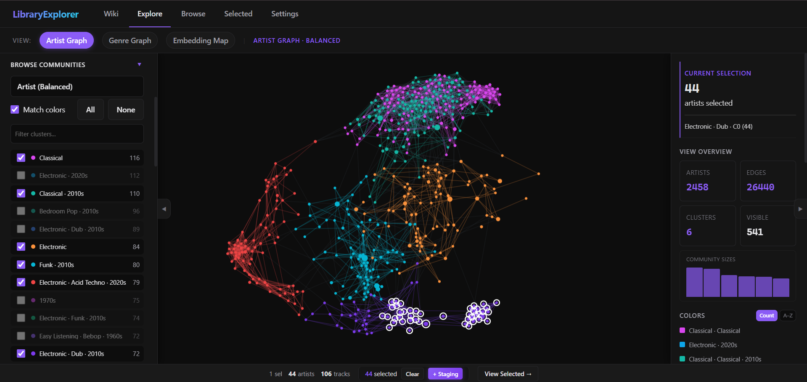
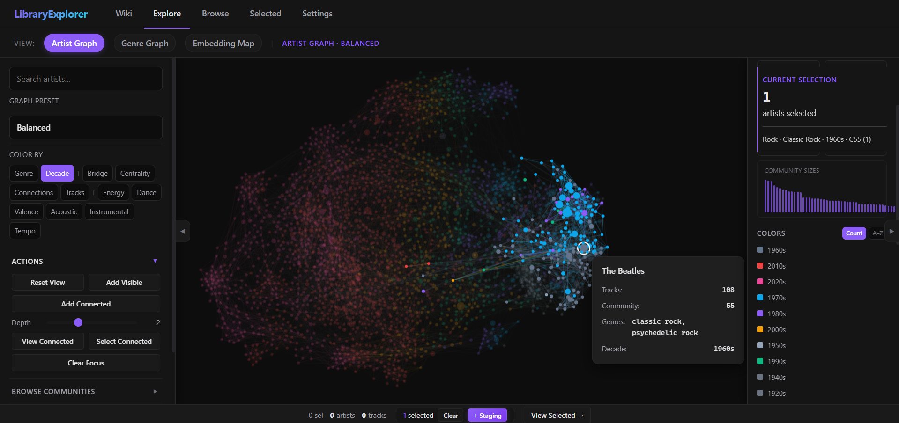
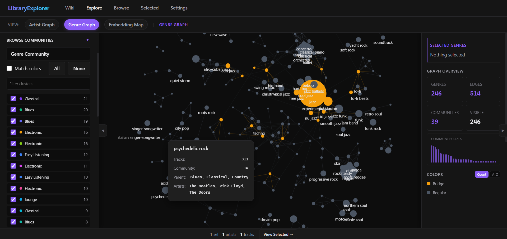
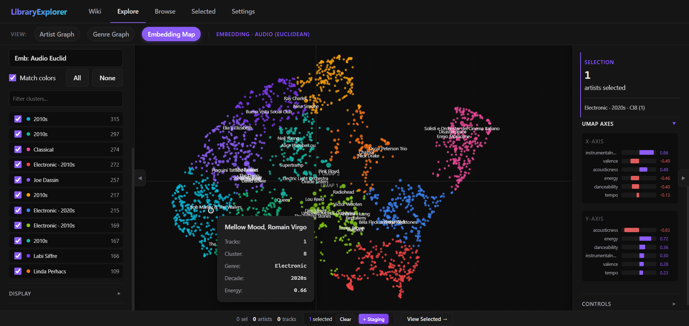
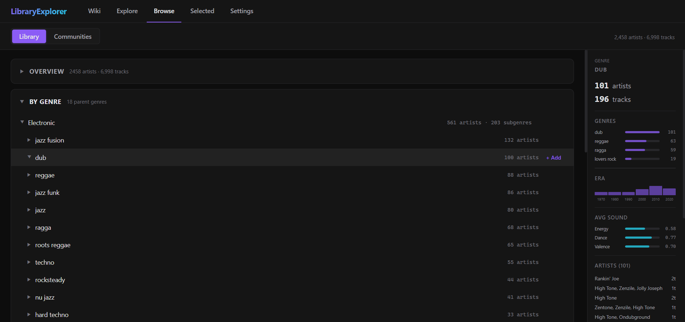

# Spotify Library Explorer

A personal Spotify library explorer for large libraries. Upload your Spotify data, then visually navigate your music through artist similarity graphs, UMAP embeddings, and genre clusters.




---

## What it does

- **Artist Graph**: force-directed network where similar artists cluster together. Louvain community detection groups them by musical overlap.
- **Embedding Map**: UMAP 2D scatter plot where proximity reflects feature similarity (audio, genre, era).
- **Browse**: genre hierarchy trees, decade histograms, community drill-down.
- **Selected**: assemble artists from any view into named sets, apply audio/metadata filters, review tracks, export to Spotify or CSV.

---

## Screenshots

### Artist Graph
Force-directed artist similarity graph for exploring communities and connections.



### Genre Graph
Genre co-occurrence network showing parent genres, connected subgenres, and bridge nodes.



### Embedding Map
2D embedding view for inspecting similarity structure across the library.



### Browse
Structured library browser with genre hierarchy, counts, and summary panels.



---

## Quick Start

### Requirements

- Python 3.10+
- A Spotify data export. See [Getting Your Data](#getting-your-data).

### Install

```bash
pip install -r requirements.txt
```

### Run

```bash
uvicorn app.api.server:app --reload
```

Then open `http://127.0.0.1:8000/ui/index.html`.

On first run the UI will prompt you to upload your data and kick off the pipeline.

---

## Getting Your Data

The easiest way is [Chosic](https://www.chosic.com/spotify-liked-songs-organizer/). Connect your Spotify account and download your liked songs as a CSV.

Then go to **Settings > Upload**, tick **"Chosic export (.csv)"**, and drop the file. The app converts it automatically.

Alternatively, upload a `normalized_tracks.json` directly if you already have one.

---

## Performance

First-run processing depends on library size and whether cached results already exist.

As a reference, processing a library of about 7,000 liked songs with no cache took around 30 minutes on a local machine.

Once the pipeline has run, the UI reads cached results from `app/cache/`.

---

## Pages

| Page | URL | Description |
|------|-----|-------------|
| Home | `/ui/index.html` | Landing with library stats |
| Artist Graph | `/ui/explore-graph-artist.html` | Force-directed artist similarity graph |
| Genre Graph | `/ui/explore-graph-genre.html` | Genre co-occurrence network |
| Embedding Map | `/ui/explore-embeddings.html` | UMAP 2D scatter plot |
| Browse | `/ui/browse.html` | Genre trees, decade histograms, cluster cards |
| Selected | `/ui/selected.html` | Curate sets, filter, export playlists |
| Settings | `/ui/settings.html` | Pipeline config, data upload, Spotify OAuth |
| Wiki | `/ui/wiki.html` | In-app user guide |

---

## Architecture

```
app/
├── core/           # Pure math: similarity, graph, clustering, embedding
├── data/           # I/O: schemas, loaders, validation
├── pipeline/       # Orchestration: cache, runner, steps
├── api/            # FastAPI server + routes
├── ui/             # Vanilla ES6 frontend (no build step)
└── tests/          # pytest + FastAPI TestClient
```

**Stack:** FastAPI · NumPy · umap-learn · NetworkX · Vanilla ES6 · Canvas

The pipeline runs once on upload and caches results. The UI reads from the cache via the API. There is no database; everything lives in JSON files under `app/cache/`.

---

## Spotify Export

To create playlists directly in Spotify:

1. Go to **Settings > Spotify Integration**
2. Create a Spotify app at [developer.spotify.com](https://developer.spotify.com/dashboard) and paste your Client ID
3. Set the redirect URI shown in Settings (it reflects your actual host/port)
4. Connect from the **Selected** page and click **Create Spotify Playlist**

Uses PKCE OAuth. No client secret required and no server-side token handling

---

## API

The backend exposes a REST API at `http://127.0.0.1:8000/api/`:

| Endpoint | Description |
|----------|-------------|
| `GET /api/graphs/{preset}` | Graph nodes, edges, communities |
| `GET /api/embedding?preset=...` | UMAP positions |
| `GET /api/tracks` | Artist list (paginated) |
| `GET /api/validation` | Data quality report |
| `GET/POST /api/config` | Pipeline configuration |
| `POST /api/upload` | Upload source data |
| `POST /api/recompute` | Trigger pipeline recomputation |
| `GET /api/recompute/{job_id}` | Poll job status |

---

## Configuration

Edit `app/config.yaml` to tune similarity weights, UMAP parameters, and graph presets. Changes take effect on the next recompute.

---

## License

MIT

---

Ludovico La Tora · Aerospace Engineering, Politecnico di Milano · 2026
